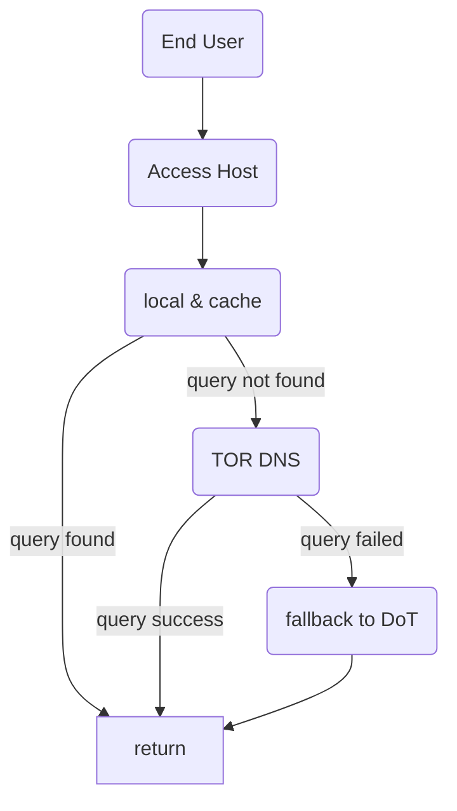

## Description
DNS server that having upstream resolver via TOR network. Only sole purpose to get IP from DNS. Packed with ads blocking and DNS query caching.

## Program

### Build & Run docker

```
docker build . -t dnsserv
docker rm -f dnsserv 2>/dev/null && docker run --name dnsserv --restart=always -dit -p 127.0.0.1:53:5353/udp dnsserv
```

Or just use generated one

```
docker rm -f dnsserv 2>/dev/null && docker run --name dnsserv --restart=always -dit -p 127.0.0.1:53:5353/udp habibiefaried/dns-over-tor-resolver
```

You can create your own config, put as a file, mount as volume to /app/config.yml. Default config is, what we have provided in docker image

### Resolving flow

Here is our resolving flow



### Scenarios

1. If the record is not found

```
2022/06/19 02:53:24 Query for puredns.rog.

[ERROR]   no answer from local & cache resolver 'Manual': query not found
[ERROR]   no answer from main TOR: lookup puredns.rog. on 192.168.1.1:53: no such host
[ERROR]   no answer from fallback resolver 'DOT-dns.google': lookup puredns.rog. on 192.168.1.1:53: no such host
[ERROR]   no answer from fallback resolver 'DOT-dns.google': lookup puredns.rog. on 192.168.1.1:53: no such host
```

2. If TOR network is not ready but record is found already (using fallback)

```
2022/06/19 02:44:22 Query for itb.ac.id.

[ERROR]   no answer from local & cache resolver 'Manual': query not found
[WARN] TOR is not initialized yet...
[SUCCESS] got answer from fallback resolver 'DOT-dns.google'
```

3. Ideal case, you get answer from tor network

```
2022/06/19 02:55:22 Query for puredns.org.

[ERROR]   no answer from local & cache resolver 'Manual': query not found
[SUCCESS] got answer from main TOR
```

4. When the query is got cached

```
2022/06/19 05:42:19 Query for itb.ac.id.
[ERROR]   no answer from local & cache resolver 'Cache': sql: no rows in result set
[ERROR]   no answer from local & cache resolver 'Manual': query not found
[SUCCESS] got answer from main TOR

2022/06/19 05:42:22 Query for itb.ac.id.
[cache HIT] domain itb.ac.id. is found 167.205.59.96 from TOR
[SUCCESS] got answer from local & cache resolver 'Cache'
```

5. TOR connection is failing

```
2022/06/19 05:14:09 error dialing remote addr socks connect tcp 127.0.0.1:43093->purednsxr4shjkobosrqf7qebwzch3e4ignfr4beq34ngr4nkp2z32id.onion:53: unknown error TTL expired
2022/06/19 05:14:09 error dialing remote addr socks connect tcp 127.0.0.1:43093->purednsxr4shjkobosrqf7qebwzch3e4ignfr4beq34ngr4nkp2z32id.onion:53: unknown error TTL expired
```

### Feature

1. query via TOR network
2. blocking ads

```
dig @localhost ads.tiktok.com

;; ANSWER SECTION:
ads.tiktok.com.         3600    IN      A       0.0.0.0

;; Query time: 0 msec
;; SERVER: 127.0.0.1#53(localhost) (UDP)
;; WHEN: Sun Jun 19 01:09:57 UTC 2022
;; MSG SIZE  rcvd: 62
```

3. If TOR fails, then fallback to DNS-over-TLS (another secured protocol)

## NOTICE

Only run and use this on local machine or trusted network. as DNS over UDP (which is default option by most machine) is unsecured protocol

## TODO

Only support "A" query right now. In the future we will add more
